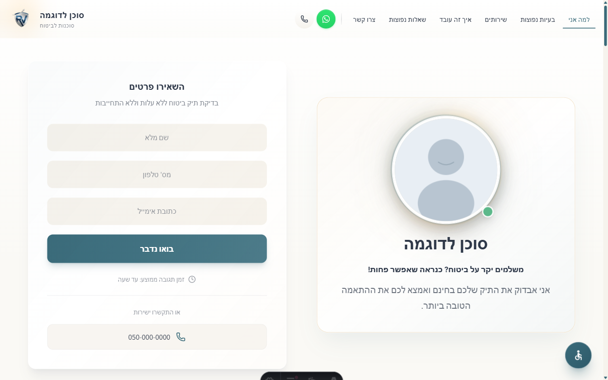
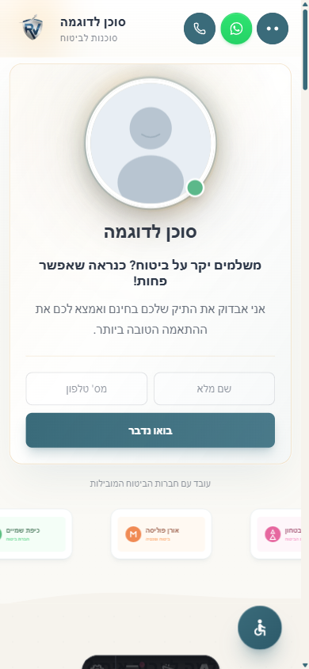

  <h1>Insurance Landing Page Template</h1>
  
A premium, conversion-optimized landing page template for insurance services. Built with modern web technologies — fast, accessible, and fully responsive.

   

---

## Preview

### Desktop

### Mobile

## Highlights

- **Conversion-Optimized Lead Capture** — Multiple strategically placed forms designed to maximize lead generation
- **High Performance** — 90+ Lighthouse performance score with optimized loading and rendering
- **Full RTL + Hebrew Support** — Native right-to-left layout with Hebrew language content
- **Git-Based CMS** — Easy content editing through a built-in admin panel, no database required
- **Comprehensive Accessibility** — WCAG-compliant accessibility menu with grayscale, high contrast, large text, link highlighting, and reduced motion options
- **Smooth Scroll Animations** — Viewport-triggered animations for a polished, modern feel
- **Mobile-First Responsive Design** — Optimized layouts from mobile to ultrawide displays
- **SEO Optimized** — Schema.org structured data, Open Graph tags, sitemap, and semantic HTML
- **Trust Bar** — Infinite scrolling partner logo marquee for social proof
- **Self-Hosted Fonts** — No external font requests for maximum performance and privacy

## Performance

| Metric         | Score |
| -------------- | ----- |
| Performance    | 90+   |
| Accessibility  | 100   |
| Best Practices | 100   |
| SEO            | 100   |

_Google PageSpeed Insights scores_

## Built With

## License

All Rights Reserved.

This is a commercial project. Source code is not included in this repository.

## Contact

**Sagi Menahem**

---

  <strong>Interested in a similar project? <a href="https://www.linkedin.com/in/sagi-menahem/">Get in touch</a>.</strong>

