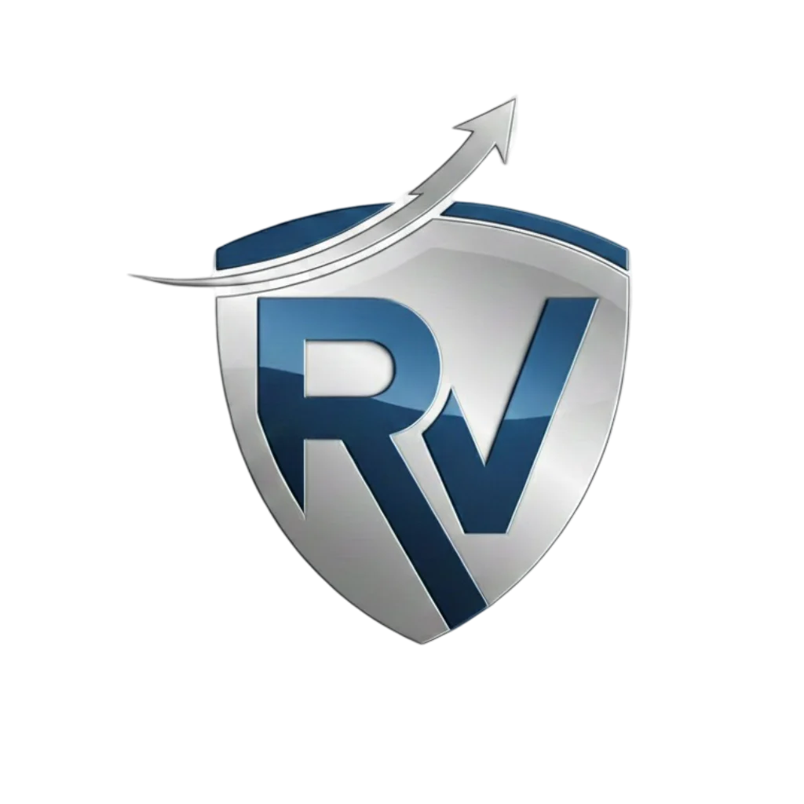

<div align="center">
  
  <h1>RV Insurance Landing Page</h1>
  <h3>Commercial Project Showcase</h3>
  <p>A high-performance, accessible lead generation landing page for RV insurance services in Israel. Built with React 19, featuring Hebrew RTL support and serverless form integration.</p>

  <a href="https://rv-ins.co.il">
    
  </a>

  <br />

</div>

---

> **Note:** This repository serves as a **technical showcase** for a commercial project. Due to client privacy and intellectual property rights, the source code is closed. However, this README documents the architectural decisions, tech stack, and features implemented in the production build.

---

<div align="center">

### Tech Stack

[](https://react.dev/)
[](https://www.typescriptlang.org/)
[](https://tailwindcss.com/)
[](https://vitejs.dev/)
[](https://www.framer.com/motion/)
[](https://www.netlify.com/)

</div>

---

## ✨ Key Features

This project was built with a focus on performance, accessibility, and conversion optimization.

- **🚀 Performance Optimized** - Lazy loading for below-the-fold sections, vendor chunk splitting (React & Framer Motion), and optimized asset delivery.
- **📱 Mobile-First Design** - Fully responsive layouts with fluid typography and touch-optimized interactions.
- **🌐 Native RTL Support** - Built from the ground up for Hebrew right-to-left layout with proper text alignment and UI mirroring.
- **♿ Comprehensive Accessibility** - A dedicated A11y menu offering:
    - Grayscale & High Contrast modes
    - Text resizing & Link highlighting
    - Reduced motion preferences
    - Full screen reader support
- **📧 Serverless Form Handling** - EmailJS integration for instant lead capture without backend infrastructure.
- **🔒 Security Hardened** - Content Security Policy headers, input validation with Israeli phone format support, and secure form submission.
- **🎯 Conversion Focused** - Strategic CTA placement, trust indicators, and social proof elements.

## 🛠️ Architecture & Technical Decisions

### 1. Adoption of Tailwind CSS v4
Implemented the latest Tailwind v4 features leveraging the new engine:
- **Zero-config approach:** Configuration handled via native CSS variables and `@theme` directives in `index.css`.
- **Performance:** Utilizing the `@tailwindcss/vite` plugin for instant HMR and smaller bundle sizes.

### 2. Smart Component Loading Strategy
```
App
├─ AccessibilityMenu (global, always available)
├─ Navbar (eager, sticky with intelligent scroll hide/show)
└─ Suspense
    ├─ Hero (eager load - critical for LCP)
    └─ Lazy sections: ProblemSolution, Credibility,
       Services, Process, FAQ, Contact, Footer
```

### 3. Centralized Content Management
To allow for easy updates without touching the codebase:
- All textual content, image paths, and data are managed in a strict TypeScript structure (`src/data/content.ts`).
- Components consume this data, making the UI purely presentational and reusable.

### 4. Custom Hooks & Utilities
Instead of relying on heavy third-party libraries:
- **`useEmailForm`**: Custom hook for form submission with validation and error handling.
- **`useScrollSpy`**: For updating navigation state based on viewport position.
- **Validation Utils**: Israeli phone number (9-10 digits) and email validation patterns.

## 🎨 Design System

The design reflects a professional, trustworthy insurance brand:

- **Palette:**
  - 🔵 **Primary Blue** (`#4A90D9`) - Trust & professionalism
  - 🟡 **Gold Accent** (`#E8A849`) - CTAs & highlights
  - ⚪ **Clean backgrounds** - Modern, uncluttered feel

- **Typography:** Self-hosted Hebrew fonts optimized for legibility and performance.

- **Animation:** Premium easing curves (`cubic-bezier(0.43, 0.13, 0.23, 0.96)`) with configurable durations respecting `prefers-reduced-motion`.

## 📊 Performance Metrics

| Metric | Score |
|--------|-------|
| Lighthouse Performance | 90+ |
| First Contentful Paint | < 1.5s |
| Cumulative Layout Shift | < 0.1 |

---

## 👨‍💻 Developed By

**Sagi Menahem**

I am a final-year Computer Science student (B.Sc.) passionate about building polished, high-performance web experiences.

[](https://github.com/sagiia)
[](https://www.linkedin.com/in/sagi-menachem/)
[](mailto:your-email@example.com)

---

<div align="center">
  <small>© 2025 All Rights Reserved. Code by Sagi Menahem.</small>
</div>
