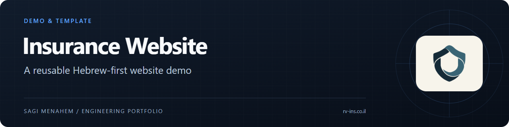
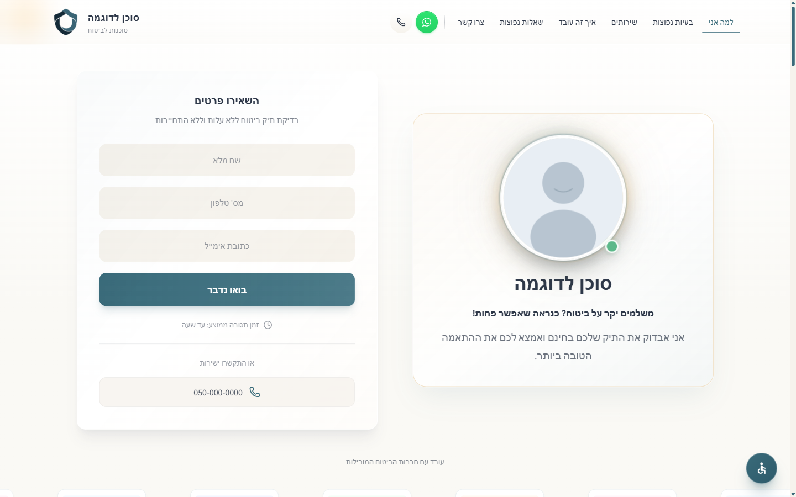
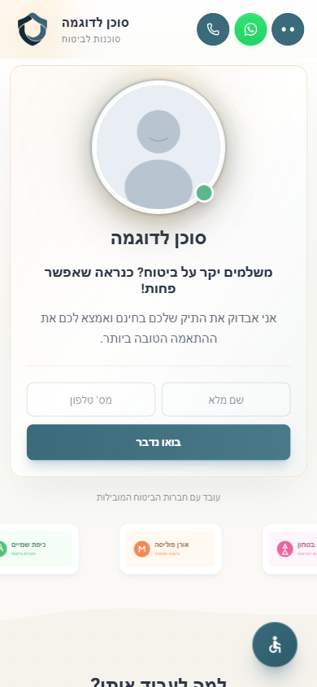

# Insurance Website

**Demo / reusable template case study.** This is a private-source demonstration for an insurance-agent website, not a production claim about a live client service.

**Type:** Demo and reusable template · **My role:** Designer and developer · **Source:** Private.

[View the live demo](https://www.rv-ins.co.il/)

   

## Preview

  
  

## Problem and solution

Insurance services depend on clarity and trust at the moment a visitor decides to enquire. This template establishes a Hebrew RTL, responsive structure for presenting services, explaining the next step, and collecting leads, while leaving content manageable through a Git-based CMS.

## Product highlights

- Hebrew RTL layout and mobile-first responsive sections.
- Lead forms and contact calls to action throughout the journey.
- Git-based CMS for maintaining copy and page content without a database.
- Structured metadata, sitemap, and social sharing metadata.
- Motion used to support section transitions and visual hierarchy.

## Engineering decisions

- **Keep the template content-led.** The CMS workflow keeps routine editorial changes separate from layout work.
- **Build for Hebrew from the layout outward.** Direction and responsive behaviour are part of the template structure rather than added after the English layout is complete.
- **Self-host visual essentials.** Fonts are bundled locally to avoid making the first visit depend on a third-party font request.

## Stack

Astro, React, TypeScript, Tailwind CSS, and Keystatic.

---

Built by [Sagi Menahem](https://sagimenahem.tech) · [AfterTech](https://www.after-tech.co.il/)
